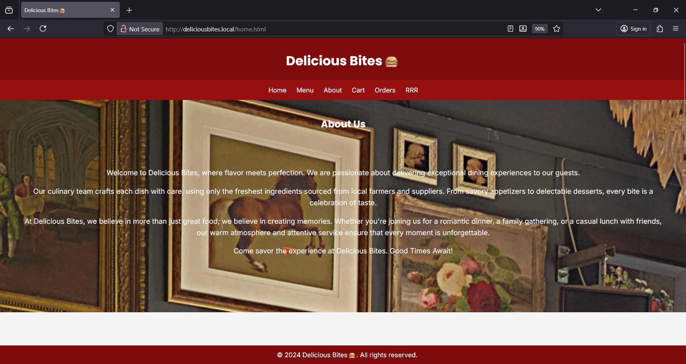
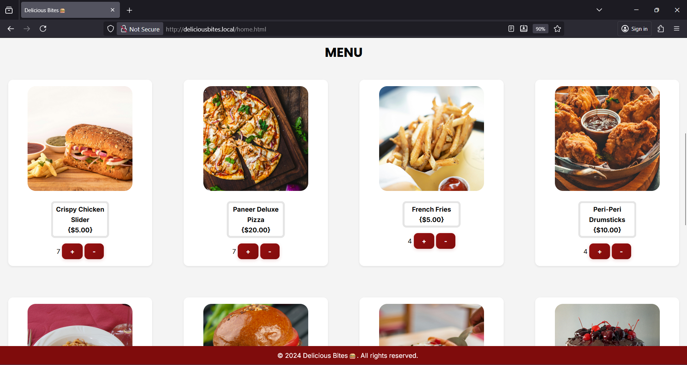
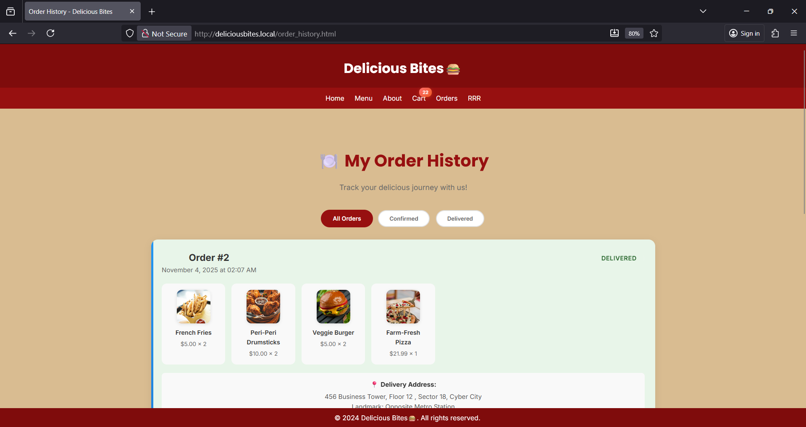
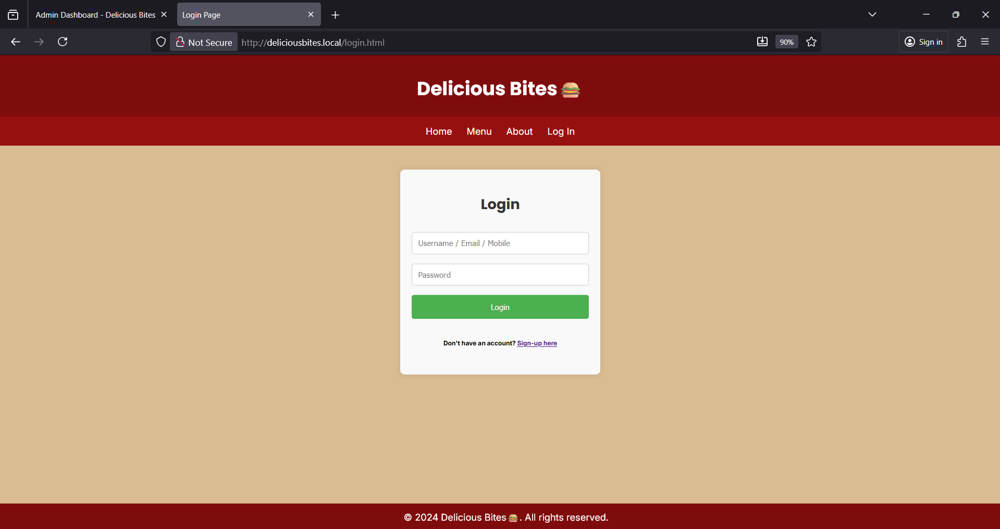
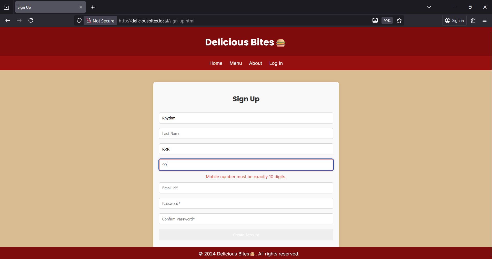
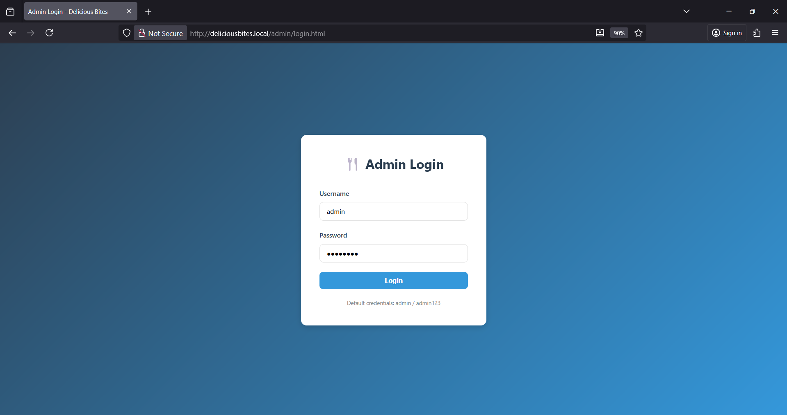
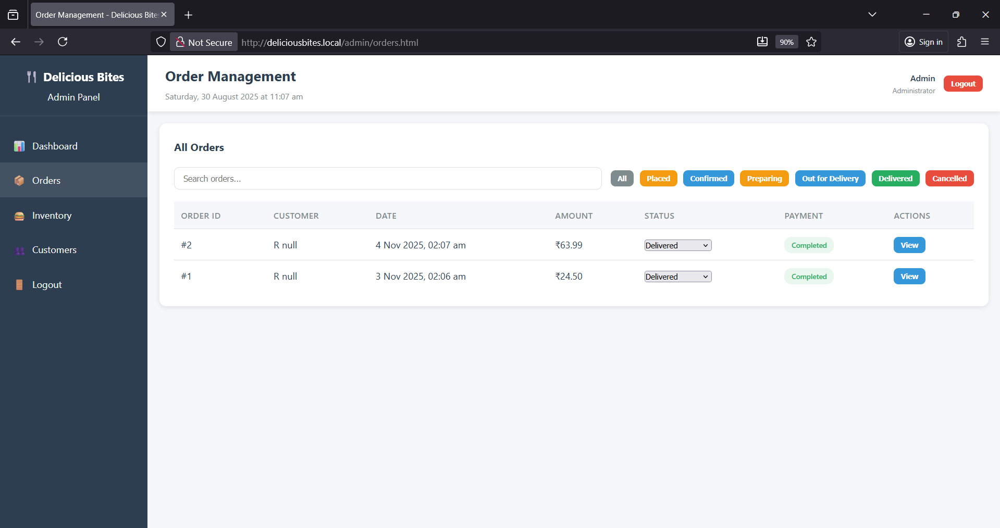
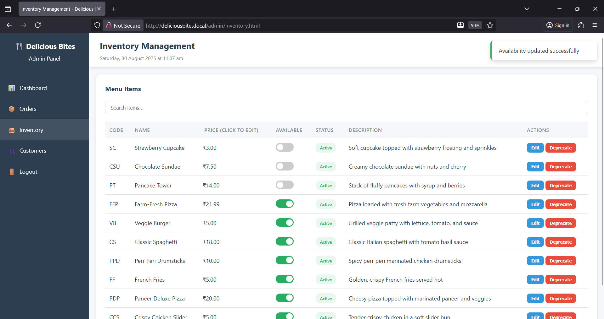
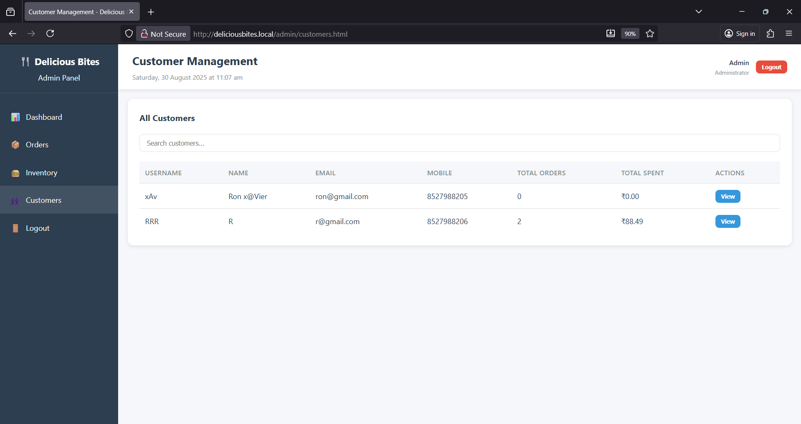
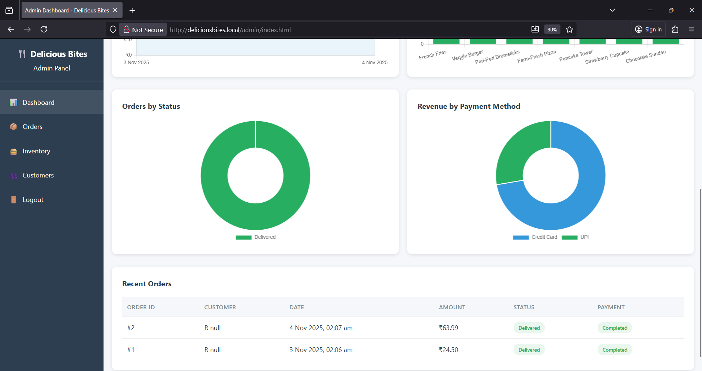

# 🍔 Delicious Bites - Restaurant Management & Ordering Platform

<p align="center">
  <strong>A full-stack restaurant ordering system with real-time order management and comprehensive admin dashboard</strong>
</p>

<p align="center">
  
  
  
</p>

---

## 📋 Table of Contents

- [Overview](#-overview)
- [Features](#-features)
- [Demo Videos](#-demo-videos)
- [Screenshots](#-screenshots)
- [Getting Started](#-getting-started)
- [Database Setup](#-database-setup)
- [Project Structure](#-project-structure)
- [API Documentation](#-api-documentation)
- [Security](#-security)
- [Roadmap](#-roadmap)

---

## 🌟 Overview

**Delicious Bites** is a modern, full-featured restaurant management platform built with a LAMP stack architecture. The system provides a seamless ordering experience for customers and powerful management tools for restaurant administrators.

### Key Highlights

- 🛒 **Dynamic Shopping Cart** - Real-time cart updates with localStorage persistence
- 💳 **Payment Integration** - Secure payment processing with multiple payment methods
- 📊 **Admin Analytics** - Comprehensive sales metrics and interactive Chart.js visualizations
- 📦 **Order Management** - Real-time order tracking with status updates
- 🔐 **Secure Authentication** - Password hashing, session management, and prepared statements
- 🎨 **Modern UI/UX** - Smooth animations, responsive design, and intuitive navigation

### Technology Stack

| Layer | Technologies |
|-------|-------------|
| **Frontend** | HTML5, CSS3, JavaScript (ES6+), jQuery, Web Components API |
| **Backend** | PHP 7.4+, Apache Web Server |
| **Database** | MySQL 8.0+, MySQLi Extension |
| **Visualization** | Chart.js 4.4.0 |
| **Security** | Bcrypt, Prepared Statements, Session Management, CSRF Tokens |

---

## ✨ Features

### Customer Features

✅ **Browse Menu** - Dynamic menu loading with real-time availability, search, and filtering  
✅ **Shopping Cart** - Add/remove items, quantity adjustments, real-time calculations, cart persistence  
✅ **Checkout & Payment** - Address management (up to 5 addresses), multiple payment methods (Credit/Debit Card, UPI, PayPal, COD)  
✅ **Order History** - View past orders with status tracking and order details  
✅ **User Authentication** - Secure registration with validation, session-based login  

### Admin Features

✅ **Analytics Dashboard** - Revenue metrics, daily orders, average order value, active customers  
✅ **Interactive Charts** - Revenue trends, top-selling items, order status distribution, payment method breakdown  
✅ **Order Management** - Real-time Kanban board (auto-refresh every 10s), status updates, detailed order views  
✅ **Inventory Management** - Toggle availability, inline price editing, item details modification  
✅ **Customer Insights** - Customer list with order history, total spending, search and filter  

---

## 🎬 Demo Videos

### Complete Customer Journey
**Browse menu → Add to cart → Checkout → Payment → Order confirmation**

https://github.com/user-attachments/assets/customer-demo.mp4

*Full user flow demonstration showing the ordering process from start to finish*

### Admin Dashboard Walkthrough
**Dashboard analytics → Order management → Inventory control → Customer insights**

https://github.com/user-attachments/assets/admin-demo.mp4

*Complete admin panel walkthrough showcasing all management features*

---

## 📸 Screenshots

### Customer Portal

<table>
  <tr>
    <td width="50%">
      
      <p align="center"><strong>Homepage with Menu</strong></p>
    </td>
    <td width="50%">
      
      <p align="center"><strong>Full Menu View</strong></p>
    </td>
  </tr>
  <tr>
    <td width="50%">
      
      <p align="center"><strong>Shopping Cart</strong></p>
    </td>
    <td width="50%">
      
      <p align="center"><strong>Order History</strong></p>
    </td>
  </tr>
  <tr>
    <td width="50%">
      
      <p align="center"><strong>Login</strong></p>
    </td>
    <td width="50%">
      
      <p align="center"><strong>Registration</strong></p>
    </td>
  </tr>
</table>

### Admin Portal

<table>
  <tr>
    <td width="50%">
      
      <p align="center"><strong>Admin Login</strong></p>
    </td>
    <td width="50%">
      
      <p align="center"><strong>Analytics Dashboard</strong></p>
    </td>
  </tr>
  <tr>
    <td width="50%">
      
      <p align="center"><strong>Order Management Board</strong></p>
    </td>
    <td width="50%">
      
      <p align="center"><strong>Inventory Management</strong></p>
    </td>
  </tr>
  <tr>
    <td width="50%">
      
      <p align="center"><strong>Customer Insights</strong></p>
    </td>
    <td width="50%">
      
      <p align="center"><strong>Detailed Analytics</strong></p>
    </td>
  </tr>
</table>

---

## 🚀 Getting Started

### Prerequisites

- **PHP** 7.4 or higher
- **MySQL** 8.0 or higher
- **Apache** Web Server (with mod_rewrite enabled)

### Installation

1. **Clone the repository**
   ```bash
   git clone https://github.com/rhythm-ravi/Delicious-Bites-Testing.git
   cd Delicious-Bites-Testing
   ```

2. **Set up the database**
   ```bash
   mysql -u root -p < DB/pro1.sql
   mysql -u root -p prodb < DB/insert_items.sql
   ```

3. **Configure database connection**
   
   Edit `php/db.php` with your database credentials:
   ```php
   $servername = "localhost";
   $username = "your_username";
   $password = "your_password";
   $database = "prodb";
   ```

4. **Add menu images**
   
   Place menu item images in:
   ```
   assets/img/menu/
   ├── 1-thumbnail.jpg
   ├── 2-thumbnail.jpg
   └── ...
   ```

5. **Access the application**
   - **Customer Portal**: `http://localhost/home.html`
   - **Admin Panel**: `http://localhost/admin/login.html`
     - Default credentials: `admin` / `admin123`

### Sample Data

To populate test orders for demonstration:

```bash
mysql -u root -p prodb < DB/sample_orders.sql
```

---

## 🗄️ Database Setup

### Core Tables

The database includes the following key tables:

**User Management**
- `customers` - User accounts with hashed passwords
- `addresses` - Customer delivery addresses (max 5 per customer)

**Menu & Inventory**
- `items` - Restaurant menu items with pricing and availability
- `menu` - Menu version tracking

**Shopping Cart**
- `carts` - Customer cart metadata
- `cart_entries` - Cart items with quantities

**Orders & Payments**
- `orders` - Order records with status tracking
- `ordered_entries` - Order line items
- `payments` - Payment transactions
- `payment_methods` - Payment method lookup

### Database Features

- **10 Automatic Triggers** for cart creation, timestamp updates, and data validation
- **Foreign Key Constraints** with proper referential integrity
- **CHECK Constraints** for data validation (username format, email, mobile, postal code)
- **JSON Data Type** for flexible address storage
- **Transaction Support** for cart persistence and order creation

---

## 📁 Project Structure

```
Delicious-Bites-Testing/
├── 📄 home.html                    # Landing page
├── 📄 cart.html                    # Shopping cart
├── 📄 checkout.html                # Checkout flow
├── 📄 order_confirmation.html      # Order success
├── 📄 login.html                   # Customer login
├── 📄 sign_up.html                 # Registration
│
├── 📁 admin/                       # Admin dashboard
│   ├── login.html
│   ├── index.html                  # Analytics
│   ├── orders.html                 # Order management
│   ├── inventory.html              # Inventory control
│   ├── customers.html              # Customer insights
│   ├── 📁 php/                     # Admin APIs
│   ├── 📁 scripts/                 # Admin JS
│   └── 📁 styles/                  # Admin CSS
│
├── 📁 php/                         # Customer APIs
│   ├── db.php
│   ├── sign_up.php
│   ├── login.php
│   ├── helper.php
│   ├── cart_update.php
│   ├── place_order.php
│   └── process_payment.php
│
├── 📁 scripts/                     # Frontend JS
│   ├── defaultUtility.js
│   ├── ui_elements.js
│   ├── init_menu.js
│   ├── init_cart.js
│   └── place_order.js
│
├── 📁 styles/                      # Frontend CSS
│   ├── basestyle.css
│   ├── mystyle.css
│   ├── cart.css
│   └── animations.css
│
├── 📁 assets/                      # Images
└── 📁 DB/                          # Database files
```

---

## 🔌 API Documentation

### Customer APIs

#### Authentication
- `POST /php/sign_up.php` - User registration with validation
- `POST /php/login.php` - User authentication with session creation

#### Menu & Cart
- `GET /php/helper.php` - Fetch complete menu with availability
- `POST /php/cart_update.php` - Update cart quantities (add/remove items)
- `POST /php/cart_read.php` - Retrieve cart from database

#### Orders & Payments
- `GET /php/get_addresses.php` - Fetch saved customer addresses
- `POST /php/place_order.php` - Create order and payment record
- `POST /php/process_payment.php` - Process payment (dummy gateway)

### Admin APIs

#### Analytics
- `GET /admin/php/analytics.php?action=summary` - Key business metrics
- `GET /admin/php/analytics.php?action=sales_chart&period=week` - Time-series data

#### Inventory
- `POST /admin/php/inventory.php?action=toggle_availability` - Toggle item availability
- `POST /admin/php/inventory.php?action=update_price` - Update item pricing

#### Orders
- `GET /admin/php/orders.php?action=list&status=all` - List orders with filters
- `POST /admin/php/orders.php?action=update_status` - Update order status

#### Customers
- `GET /admin/php/customers.php?action=list` - List all customers
- `GET /admin/php/customers.php?action=details&cust_id=X` - Customer profile with history

---

## 🔒 Security

### Implemented Security Measures

✅ **Password Security** - Bcrypt hashing with `password_hash()`, minimum 8 characters  
✅ **SQL Injection Prevention** - Prepared statements on all queries  
✅ **Session Management** - Session ID regeneration on login, HttpOnly cookies  
✅ **CSRF Protection** - Tokens on state-changing forms  
✅ **Input Validation** - Client and server-side validation with regex constraints  
✅ **Access Control** - Admin routes protected, customer data isolated by session  

### Production Recommendations

🔐 **Enable HTTPS** - Use SSL/TLS certificates  
🔐 **Environment Variables** - Move DB credentials to `.env`  
🔐 **Rate Limiting** - Implement login attempt limits  
🔐 **Update Dependencies** - Upgrade jQuery or migrate to Fetch API  
🔐 **Error Logging** - Centralized logging without exposing details to users  

---

## 🗺️ Roadmap

### ✅ Completed Features
- Three-tier LAMP architecture
- User authentication with password hashing
- Dynamic menu with real-time availability
- Shopping cart with persistence
- Complete checkout and payment flow
- Admin dashboard with analytics
- Order management system
- Inventory management

### 🚧 In Progress
- Email notifications (order confirmation, status updates)
- Customer order history page
- Enhanced admin reporting

### 📋 Planned Features
- SMS notifications via Twilio
- Real-time notifications with WebSockets
- Customer reviews and ratings
- Loyalty points system
- Mobile app (React Native)
- Multi-restaurant support
- Delivery tracking with maps

---

## 🤝 Contributing

Contributions are welcome! Please follow these steps:

1. Fork the repository
2. Create a feature branch (`git checkout -b feature/AmazingFeature`)
3. Commit your changes (`git commit -m 'Add AmazingFeature'`)
4. Push to the branch (`git push origin feature/AmazingFeature`)
5. Open a Pull Request

---

## 👨‍💻 Author

**Rhythm Ravi** ([@rhythm-ravi](https://github.com/rhythm-ravi))

---

## 📧 Support

For support, open an issue in the GitHub repository.

---

<p align="center">
  Made with ❤️ and 🍔 by the Delicious Bites Team
</p>

<p align="center">
  <a href="#-table-of-contents">Back to Top ⬆️</a>
</p>