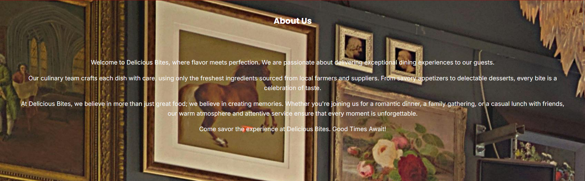

# 🍔 Delicious Bites - Restaurant Management & Ordering Platform

<p align="center">
  
</p>

<p align="center">
  <strong>A full-stack restaurant ordering system with real-time order management and comprehensive admin dashboard</strong>
</p>

<p align="center">
  
  
  
  
  
</p>

---

## 📋 Table of Contents

- [Overview](#-overview)
- [Features](#-features)
- [Demo](#-demo)
- [Architecture](#-architecture)
- [Screenshots](#-screenshots)
- [Getting Started](#-getting-started)
- [Database Schema](#-database-schema)
- [Project Structure](#-project-structure)
- [API Documentation](#-api-documentation)
- [Security](#-security)
- [Contributing](#-contributing)
- [License](#-license)

---

## 🌟 Overview

**Delicious Bites** is a modern, full-featured restaurant management platform built with a classic LAMP stack architecture. The system provides a seamless ordering experience for customers and powerful management tools for restaurant administrators.

### Key Highlights

- 🛒 **Dynamic Shopping Cart** - Real-time cart updates with localStorage persistence
- 💳 **Integrated Payment Gateway** - Secure payment processing with multiple payment methods
- 📊 **Admin Analytics Dashboard** - Comprehensive sales metrics and interactive charts
- 📦 **Order Management System** - Real-time order tracking with status updates
- 🔐 **Secure Authentication** - Password hashing, session management, and CSRF protection
- 🎨 **Modern UI/UX** - Smooth animations, responsive design, and intuitive navigation

<p align="center">
  
</p>

---

## ✨ Features

### Customer Features

#### 🍕 Browse Menu
- Dynamic menu loading with real-time availability
- High-quality food images with descriptions and pricing
- Category filtering and search functionality
- Smooth scroll animations and hover effects

<p align="center">
  
</p>

#### 🛒 Shopping Cart
- Add/remove items with instant visual feedback
- Quantity adjustments with +/- buttons
- Real-time price calculations
- Cart persistence across sessions
- Empty cart state with call-to-action

<p align="center">
  
</p>

#### 💳 Checkout & Payment
- Address management (save up to 5 addresses)
- Multiple payment method support (Credit Card, Debit Card, UPI, PayPal, COD)
- Order notes and special instructions
- Payment processing with loading animations
- Order confirmation with success animations

<p align="center">
  
</p>

<details>
<summary><strong>View Checkout Process Animation</strong></summary>


*Complete checkout flow from cart to payment confirmation*

</details>

#### 🔐 User Authentication
- Secure registration with password strength validation
- Email and mobile uniqueness checks
- Session-based login with remember-me option
- Profile management

<p align="center">
  
  
</p>

---

### Admin Features

#### 📊 Analytics Dashboard
- **Key Metrics Cards**
  - Total revenue with growth indicators
  - Daily order count
  - Average order value
  - Active customer statistics

- **Interactive Charts** (Chart.js)
  - Revenue trends over time (line chart)
  - Top 10 selling items (bar chart)
  - Order status distribution (pie chart)
  - Payment method breakdown (pie chart)

<p align="center">
  
</p>

#### 📦 Order Management
- **Real-time Order Board** (Kanban-style)
  - Auto-refresh every 10 seconds
  - Status columns: Placed → Confirmed → Preparing → Out for Delivery → Delivered
  - Color-coded order cards
  - Detailed order modals with customer info and items

<p align="center">
  
</p>

<details>
<summary><strong>View Order Management Demo</strong></summary>


*Real-time order status updates and management*

</details>

#### 🍔 Inventory Management
- **Item Management Features**
  - Toggle availability with instant updates (green/red indicators)
  - Inline price editing (click-to-edit)
  - Item details modification
  - Deprecation marking
  - Search, sort, and filter capabilities

<p align="center">
  
</p>

#### 👥 Customer Insights
- Customer list with order history
- Total orders and spending per customer
- Search and filtering options
- Detailed customer profile modals

<p align="center">
  
</p>

---

## 🎬 Demo

### Complete User Journey

> 📹 **Full application walkthrough showing the complete ordering process**


*Experience the entire flow: Browse menu → Add to cart → Checkout → Payment → Order confirmation*

### Admin Dashboard Walkthrough

> 📹 **Admin panel features and order management**


*Explore analytics, order management, inventory control, and customer insights*

### Quick Feature Previews

<table>
  <tr>
    <td width="50%">
      
      <p align="center"><em>Interactive menu with add-to-cart animations</em></p>
    </td>
    <td width="50%">
      
      <p align="center"><em>Real-time cart quantity adjustments</em></p>
    </td>
  </tr>
  <tr>
    <td width="50%">
      
      <p align="center"><em>Payment processing with status animations</em></p>
    </td>
    <td width="50%">
      
      <p align="center"><em>Instant availability toggling in admin panel</em></p>
    </td>
  </tr>
</table>

---

## 🏗️ Architecture

### Three-Tier Architecture

```
┌─────────────────────────────────────────────────────────────┐
│                     PRESENTATION LAYER                       │
│  HTML5 • CSS3 • JavaScript • Web Components • jQuery         │
│  (User Interface, Client-side Cart, Form Validation)        │
└────────────────────┬────────────────────────────────────────┘
                     │ AJAX / Fetch API
                     ▼
┌─────────────────────────────────────────────────────────────┐
│                    APPLICATION LAYER                         │
│              PHP (Procedural) REST-ish API                   │
│  (Authentication, Menu, Cart, Orders, Payments, Admin)      │
└────────────────────┬────────────────────────────────────────┘
                     │ MySQLi / Prepared Statements
                     ▼
┌─────────────────────────────────────────────────────────────┐
│                       DATA LAYER                             │
│                  MySQL Database (prodb)                      │
│  (Customers, Items, Orders, Payments, Carts, Addresses)     │
└─────────────────────────────────────────────────────────────┘
```

<p align="center">
  
</p>

### Technology Stack

| Layer | Technologies |
|-------|-------------|
| **Frontend** | HTML5, CSS3, JavaScript (ES6+), jQuery 1.7.1, Web Components API |
| **Backend** | PHP 7.4+, Apache Web Server |
| **Database** | MySQL 8.0+, MySQLi Extension |
| **Charts** | Chart.js 4.4.0 |
| **Security** | Password Hashing (bcrypt), Prepared Statements, Session Management, CSRF Tokens |
| **Design** | Custom CSS, Responsive Design, CSS Animations |

---

## 📸 Screenshots

### Customer Portal

<details open>
<summary><strong>Home Page</strong></summary>

<p align="center">
  
</p>

<p align="center">
  
</p>

</details>

<details>
<summary><strong>Menu Page</strong></summary>

<p align="center">
  
</p>

<p align="center">
  
</p>

</details>

<details>
<summary><strong>Cart & Checkout</strong></summary>

<p align="center">
  
</p>

<p align="center">
  
</p>

<p align="center">
  
</p>

<p align="center">
  
</p>

</details>

<details>
<summary><strong>Order Confirmation</strong></summary>

<p align="center">
  
</p>

<p align="center">
  
</p>

</details>

### Admin Portal

<details open>
<summary><strong>Dashboard & Analytics</strong></summary>

<p align="center">
  
</p>

<p align="center">
  
</p>

</details>

<details>
<summary><strong>Order Management</strong></summary>

<p align="center">
  
</p>

<p align="center">
  
</p>

</details>

<details>
<summary><strong>Inventory Management</strong></summary>

<p align="center">
  
</p>

<p align="center">
  
</p>

</details>

### Mobile Responsive Views

<p align="center">
  
  
  
</p>

---

## 🚀 Getting Started

### Prerequisites

- **PHP** 7.4 or higher
- **MySQL** 8.0 or higher
- **Apache** Web Server (with mod_rewrite enabled)
- **Composer** (optional, for future dependency management)

### Installation

1. **Clone the repository**
   ```bash
   git clone https://github.com/rhythm-ravi/Delicious-Bites-Testing.git
   cd Delicious-Bites-Testing
   ```

2. **Set up the database**
   ```bash
   mysql -u root -p < DB/pro1.sql
   mysql -u root -p prodb < DB/insert_items.sql
   ```

3. **Configure database connection**
   
   Edit `php/db.php` with your database credentials:
   ```php
   $servername = "localhost";
   $username = "your_username";
   $password = "your_password";
   $database = "prodb";
   ```

4. **Configure Apache**
   
   Ensure your Apache `DocumentRoot` points to the project directory or use a virtual host:
   ```apache
   <VirtualHost *:80>
       ServerName delicious-bites.local
       DocumentRoot "/path/to/Delicious-Bites-Testing"
       <Directory "/path/to/Delicious-Bites-Testing">
           AllowOverride All
           Require all granted
       </Directory>
   </VirtualHost>
   ```

5. **Add assets (if not included)**
   
   Place menu item images in:
   ```
   assets/img/menu/
   ├── 1-thumbnail.jpg
   ├── 2-thumbnail.jpg
   └── ...
   ```

6. **Access the application**
   - **Customer Portal**: `http://localhost/home.html`
   - **Admin Panel**: `http://localhost/admin/login.html`
     - Default credentials: `admin` / `admin123` (change after first login)

### Quick Test with Sample Data

To populate some test orders for user 'RRR':

```bash
mysql -u root -p prodb < DB/sample_orders.sql
```

---

## 🗄️ Database Schema

### Entity Relationship Diagram

<p align="center">
  
</p>

### Core Tables

#### Customers & Authentication
- `customers` - User accounts with hashed passwords
- `addresses` - Customer delivery addresses (max 5 per customer)
- `states` - Indian states lookup table

#### Menu & Inventory
- `items` - Restaurant menu items with pricing and availability
- `menu` - Menu version tracking (last_updated timestamp)

#### Cart System
- `carts` - Customer cart metadata with versioning
- `cart_entries` - Individual cart items with quantities

#### Orders & Payments
- `orders` - Order records with address JSON and status
- `ordered_entries` - Order line items with historical pricing
- `payments` - Payment transactions with status tracking
- `payment_methods` - Payment method lookup table

### Database Triggers

The schema includes **10 automatic triggers** for:
- Cart creation on customer registration
- Menu timestamp updates on item changes
- Cart timestamp updates on cart modifications
- Address limit enforcement (max 5 per customer)

<details>
<summary><strong>View Complete Schema</strong></summary>

```sql
-- Full schema available in DB/pro1.sql
-- Key features:
-- - Foreign key constraints with cascading
-- - CHECK constraints for data validation
-- - Auto-increment primary keys
-- - JSON data type for flexible address storage
-- - ENUM types for status fields
-- - Timestamp fields with automatic updates
```

</details>

---

## 📁 Project Structure

```
Delicious-Bites-Testing/
├── 📄 home.html                    # Landing page with menu
├── 📄 cart.html                    # Shopping cart page
├── 📄 checkout.html                # Checkout and payment
├── 📄 order_confirmation.html      # Order success page
├── 📄 login.html                   # Customer login
├── 📄 sign_up.html                 # Customer registration
├── 📄 account_created.html         # Registration success
├── 📄 success_login.html           # Login success
├── 📄 failure_login.html           # Login failure
│
├── 📁 admin/                       # Admin dashboard (private)
│   ├── 📄 login.html               # Admin login
│   ├── 📄 index.html               # Analytics dashboard
│   ├── 📄 orders.html              # Order management
│   ├── 📄 inventory.html           # Inventory management
│   ├── 📄 customers.html           # Customer insights
│   ├── 📁 php/                     # Admin API endpoints
│   │   ├── admin_auth.php
│   │   ├── analytics.php
│   │   ├── orders.php
│   │   ├── inventory.php
│   │   └── customers.php
│   ├── 📁 scripts/                 # Admin JavaScript
│   │   ├── admin.js
│   │   ├── dashboard.js
│   │   ├── orders.js
│   │   ├── inventory.js
│   │   └── customers.js
│   └── 📁 styles/                  # Admin CSS
│       ├── admin.css
│       └── charts.css
│
├── 📁 php/                         # Customer API endpoints
│   ├── db.php                      # Database connection
│   ├── sign_up.php                 # Registration API
│   ├── login.php                   # Authentication API
│   ├── helper.php                  # Menu data API
│   ├── menu.php                    # Menu fetching
│   ├── closer.php                  # Cart persistence on logout
│   ├── cart_read.php               # Read cart from DB
│   ├── cart_update.php             # Update cart in DB
│   ├── get_addresses.php           # Fetch customer addresses
│   ├── place_order.php             # Order creation API
│   └── process_payment.php         # Payment processing API
│
├── 📁 scripts/                     # Frontend JavaScript
│   ├── defaultUtility.js           # User utility functions
│   ├── defaultUI.js                # UI helper functions
│   ├── ui_elements.js              # Web Components definitions
│   ├── init_menu.js                # Menu page initialization
│   ├── init_cart.js                # Cart page initialization
│   ├── place_order.js              # Order placement logic
│   ├── login.js                    # Login page logic
│   ├── sign_up.js                  # Registration page logic
│   ├── sign_out.js                 # Logout logic
│   ├── loggedin.js                 # Session validation
│   └── animations.js               # Animation utilities
│
├── 📁 styles/                      # Frontend CSS
│   ├── basestyle.css               # Global base styles
│   ├── mystyle.css                 # Home page styles
│   ├── cart.css                    # Cart page styles
│   ├── login.css                   # Auth pages styles
│   ├── menu.css                    # Menu-specific styles
│   └── animations.css              # Animation keyframes
│
├── 📁 assets/                      # Static assets
│   └── img/
│       ├── menu/                   # Menu item images
│       │   ├── 1-thumbnail.jpg
│       │   └── ...
│       └── bgimg.jpg               # Background image
│
├── 📁 DB/                          # Database files
│   ├── pro1.sql                    # Complete schema
│   ├── insert_items.sql            # Sample menu items
│   └── sample_orders.sql           # Test order data
│
├── 📁 docs/                        # Documentation assets
│   ├── images/                     # README screenshots
│   └── videos/                     # README demo videos
│
└── 📄 README.md                    # This file
```

---

## 🔌 API Documentation

### Customer APIs

#### Authentication

**POST** `/php/sign_up.php`
```javascript
// Request
{
  "username": "johndoe",
  "first_name": "John",
  "last_name": "Doe",
  "mobile": "9876543210",
  "email_id": "john@example.com",
  "password": "SecurePass123"
}

// Response
{
  "success": true,
  "message": "Account created successfully"
}
```

**POST** `/php/login.php`
```javascript
// Request
{
  "username": "johndoe",
  "password": "SecurePass123"
}

// Response (sets session cookie)
{
  "success": true,
  "user_id": 123,
  "username": "johndoe"
}
```

#### Menu & Cart

**GET** `/php/helper.php`
```javascript
// Returns complete menu with availability
{
  "1": {
    "id": 1,
    "name": "Crispy Chicken Slider",
    "price": 5.00,
    "availability": true,
    "item_desc": "Tender crispy chicken...",
    "img_url": "assets/img/menu/1-thumbnail.jpg"
  },
  // ...
}
```

**POST** `/php/cart_update.php`
```javascript
// Request
{
  "item_id": 1,
  "qty_change": 1,  // +1 to add, -1 to remove
  "prev_timestamp": "2025-11-04 10:30:00"
}

// Response
{
  "success": true,
  "new_timestamp": "2025-11-04 10:35:00"
}
```

#### Orders & Payments

**POST** `/php/place_order.php`
```javascript
// Request
{
  "address_id": 5,
  "payment_method_id": 4,
  "notes": "Ring doorbell twice"
}

// Response
{
  "success": true,
  "order_id": 42,
  "txn_reference": "TXN-1730753628-7834",
  "total_amount": 45.50
}
```

**POST** `/php/process_payment.php`
```javascript
// Request
{
  "order_id": 42,
  "txn_reference": "TXN-1730753628-7834",
  "payment_method_id": 4
}

// Response
{
  "success": true,
  "message": "Payment processed successfully",
  "order_id": 42,
  "payment_status": "Completed"
}
```

### Admin APIs

#### Analytics

**GET** `/admin/php/analytics.php?action=summary`
```javascript
{
  "total_revenue": 12450.75,
  "revenue_today": 1234.50,
  "revenue_this_week": 5678.90,
  "orders_total": 342,
  "orders_today": 23,
  "avg_order_value": 36.43,
  "customer_count": 156
}
```

**GET** `/admin/php/analytics.php?action=sales_chart&period=week`
```javascript
[
  { "date": "2025-11-01", "revenue": 450.50 },
  { "date": "2025-11-02", "revenue": 523.75 },
  // ...
]
```

#### Inventory Management

**POST** `/admin/php/inventory.php?action=toggle_availability`
```javascript
// Request
{
  "item_id": 3
}

// Response
{
  "success": true,
  "new_availability": false
}
```

**POST** `/admin/php/inventory.php?action=update_price`
```javascript
// Request
{
  "item_id": 5,
  "new_price": 19.99
}

// Response
{
  "success": true,
  "updated_price": 19.99
}
```

#### Order Management

**POST** `/admin/php/orders.php?action=update_status`
```javascript
// Request
{
  "order_id": 42,
  "new_status": "Preparing"
}

// Response
{
  "success": true,
  "order_id": 42,
  "status": "Preparing"
}
```

<details>
<summary><strong>View Complete API Reference</strong></summary>

Full API documentation with request/response schemas, error codes, and examples available in `/docs/API.md`

</details>

---

## 🔒 Security

### Implemented Security Measures

✅ **Password Security**
- Bcrypt hashing (`password_hash()` with `PASSWORD_DEFAULT`)
- Minimum 8-character requirement enforced at DB level
- No plaintext password storage

✅ **SQL Injection Prevention**
- All queries use prepared statements with parameterized queries
- Input sanitization on all user inputs

✅ **Session Management**
- Session ID regeneration on login
- HttpOnly and Secure cookie flags
- 30-minute admin session timeout
- Session validation on every protected page

✅ **CSRF Protection**
- CSRF tokens on all state-changing forms
- Token validation in PHP endpoints

✅ **Input Validation**
- Client-side validation with visual feedback
- Server-side validation on all endpoints
- Regex constraints in database schema (username, email, mobile, postal code)

✅ **Access Control**
- Admin routes protected with session checks
- Customer data isolated by session user ID
- No admin links exposed on customer portal

### Security Best Practices

🔐 **Recommendations for Production**

1. **Enable HTTPS** - Use SSL/TLS certificates (Let's Encrypt)
2. **Environment Variables** - Move DB credentials to `.env` file
3. **Rate Limiting** - Implement login attempt limits
4. **Content Security Policy** - Add CSP headers
5. **Update Dependencies** - Upgrade jQuery to latest version or migrate to Fetch API
6. **Database Backups** - Automated daily backups
7. **Error Logging** - Centralized error logging (not exposed to users)
8. **Input Sanitization** - Use `htmlspecialchars()` on all output

---

## 🎨 Design System

### Color Palette

```css
/* Customer Portal */
--primary-red: #7f0c0c;
--primary-red-dark: #971010;
--accent-gray: #646464;
--background-beige: #d9bc91;
--success-green: #4CAF50;
--text-dark: #333;

/* Admin Portal */
--admin-primary: #2C3E50;
--admin-accent: #3498DB;
--admin-success: #27AE60;
--admin-warning: #F39C12;
--admin-danger: #E74C3C;
--admin-background: #F5F7FA;
```

### Typography

- **Headings**: Franklin Gothic Medium, Arial Narrow, Arial, sans-serif
- **Body**: System fonts for performance
- **Admin**: Inter, Roboto, system-ui

### Component Library

<p align="center">
  
</p>

---

## 🧪 Testing

### Manual Testing Checklist

- [ ] User registration with validation
- [ ] User login and session persistence
- [ ] Browse menu and add items to cart
- [ ] Cart quantity updates and persistence
- [ ] Checkout with address selection
- [ ] Payment processing (success and failure)
- [ ] Order confirmation display
- [ ] Admin login
- [ ] Admin dashboard analytics load
- [ ] Toggle item availability
- [ ] Edit item price
- [ ] Update order status
- [ ] View customer details

### Test Users

```sql
-- Customer (after registration)
Username: testuser
Password: Test1234

-- Admin
Username: admin
Password: admin123
```

---

## 🤝 Contributing

Contributions are welcome! Please follow these guidelines:

1. **Fork the repository**
2. **Create a feature branch** (`git checkout -b feature/AmazingFeature`)
3. **Commit your changes** (`git commit -m 'Add some AmazingFeature'`)
4. **Push to the branch** (`git push origin feature/AmazingFeature`)
5. **Open a Pull Request**

### Development Guidelines

- Follow existing code style and conventions
- Use prepared statements for all database queries
- Add comments for complex logic
- Test thoroughly before submitting PR
- Update documentation as needed

---

## 🗺️ Roadmap

### Phase 1: Core Enhancements ✅
- [x] Complete payment pipeline
- [x] Admin dashboard with analytics
- [x] Order management system
- [x] Inventory management

### Phase 2: Advanced Features 🚧
- [ ] Email notifications (order confirmation, status updates)
- [ ] SMS notifications via Twilio
- [ ] Order history page for customers
- [ ] Real-time notifications (WebSockets)
- [ ] Customer reviews and ratings
- [ ] Loyalty points system

### Phase 3: Optimization 📋
- [ ] Migrate to modern JavaScript framework (React/Vue)
- [ ] REST API with JWT authentication
- [ ] Mobile app (React Native)
- [ ] Performance optimizations (caching, CDN)
- [ ] SEO improvements
- [ ] PWA implementation

### Phase 4: Business Features 📋
- [ ] Multi-restaurant support
- [ ] Delivery tracking with maps
- [ ] Rider management system
- [ ] Promotional codes and discounts
- [ ] Subscription plans
- [ ] Reporting and export features

---

## 📝 License

This project is licensed under the MIT License - see the [LICENSE](LICENSE) file for details.

---

## 👨‍💻 Author

**Rhythm Ravi** ([@rhythm-ravi](https://github.com/rhythm-ravi))

---

## 🙏 Acknowledgments

- Menu item images from [Unsplash](https://unsplash.com)
- Chart.js for beautiful visualizations
- Icons from Font Awesome (if used)
- Background patterns from [Subtle Patterns](https://www.toptal.com/designers/subtlepatterns/)

---

## 📧 Support

For support, email rhythm.ravi@example.com or open an issue in the GitHub repository.

---

<p align="center">
  Made with ❤️ and 🍔 by the Delicious Bites Team
</p>

<p align="center">
  <a href="#-table-of-contents">Back to Top ⬆️</a>
</p>